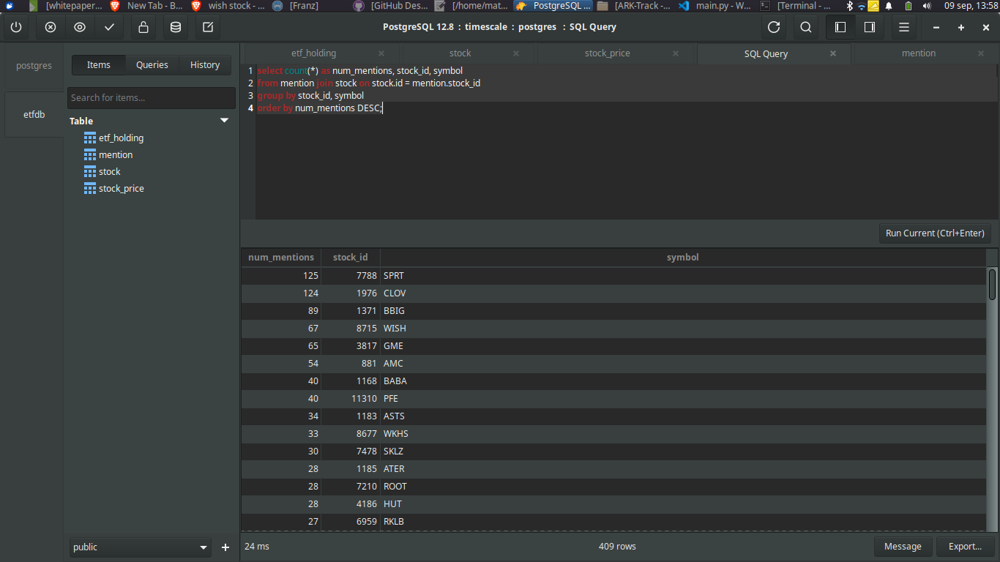

# WallStreetBets-Tracker

Wall Street Tracker app with Python, Reddit API and SQL

Project from: https://youtu.be/CJAdCLZaISw

## 1. Create "requirements.txt" file and install libraries

Libraries:

- PSAW: Python Pushshift.io API Wrapper (for comment/submission search). A minimalist wrapper for searching public reddit comments/submissions via the pushshift.io API. https://psaw.readthedocs.io/en/latest/#

- psycopg2: Psycopg is the most popular PostgreSQL database adapter for the Python programming language. https://pypi.org/project/psycopg2/

```bash
pip install -r requirements.txt
```

## 2. Create "main.py" file

- Import libraries
- First 10 submissions to /r/wallstreetbets in 2021, filtering results to url/author/title/subreddit fields. (GET JSON)


- Save output in "wsb.txt". (https://www.howtogeek.com/299219/how-to-save-the-output-of-a-command-to-a-file-in-bash-aka-the-linux-and-macos-terminal/)

```bash
python3 main.py > wsb.txt
```

- Filter title with Python – Filter list elements starting with given Prefix (https://bit.ly/38v59dj)

- Create a DB "create_tables.sql"

- Go to Terminal

```bash
sudo docker ps
```

```bash
sudo docker exec -it timescaledb bash
```

```bash
psql -U postgres
```

```bash
CREATE TABLE mention (
    stock_id INTEGER,
    dt TIMESTAMP WITHOUT TIME ZONE NOT NULL, -- dt = datetime
    message TEXT NOT NULL,
    source TEXT NOT NULL, -- wsb - twitter - stocks
    url TEXT NOT NULL,
    PRIMARY KEY (stock_id, dt),
    CONSTRAINT fk_mention_stock FOREIGN KEY (stock_id) REFERENCES stock (id)
);

CREATE INDEX ON mention (stock_id, dt DESC);
SELECT create_hypertable('mention', 'dt');
```

- Go to TablesPLus and code into "SQL Query"

```bash
select count(*) as num_mentions, stock_id, symbol
from mention join stock on stock.id = mention.stock_id
group by stock_id, symbol
order by num_mentions DESC;
```


